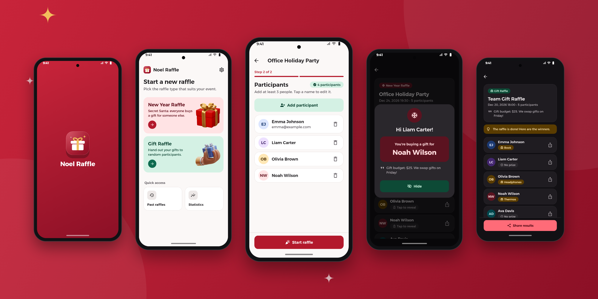

# Noel Raffle App

A Flutter app for running raffles with friends, family or colleagues. It needs no
server: every raffle is drawn on the phone. Firebase's free Spark plan is optional
and adds online result codes.

# Screenshots



## Features

- **New Year raffle (Secret Santa):** everyone is assigned one person to buy a gift for.
  The draw forms a single circle, so nobody draws themselves and no two people just swap.
- **Gift raffle:** list the gifts (with quantities) and they are handed out to random
  participants, with at most one gift per person.
- **Secret results on one phone:** results stay hidden. Pass the phone around, and
  each person taps their own name to see their result.
- **Share results** one by one through WhatsApp, SMS or any app, or by email from your
  own mail app (participant emails are optional).
- **Online codes (optional, Firebase):** every participant gets a personal code and sees
  only their own result under "View My Result" in the app, on their own phone.
- **History and statistics** are kept on the device. With Firebase you also get
  totals across all users.
- Turkish, English and Arabic (RTL), light/dark theme.

## Getting Started

### Prerequisites

- Flutter SDK (recent stable; Dart `>=3.2.3 <4.0.0`)
- Android Studio or VS Code

### Installation

```bash
flutter pub get
flutter run
```

The app runs fully offline as is. The online features stay hidden until Firebase
is configured.

## Firebase setup (optional)

Everything below fits in Firebase's free **Spark** plan. No Cloud Functions or
billing account is needed.

1. Create a project in the [Firebase console](https://console.firebase.google.com/).
2. **Authentication → Sign-in method:** enable **Anonymous**.
3. **Firestore Database:** create a database (production mode).
4. Connect the app. This overwrites the placeholder `lib/firebase_options.dart` and adds
   the platform config files:
   ```bash
   dart pub global activate flutterfire_cli
   flutterfire configure
   ```
5. Deploy the security rules from `firebase/firestore.rules`:
   ```bash
   npm install -g firebase-tools
   firebase login
   firebase use --add            # pick your project
   firebase deploy --only firestore:rules
   ```
   You can also paste the file into **Firestore → Rules** in the console.

### What is stored

| Path | Content | Access |
| --- | --- | --- |
| `results/{code}` | One participant's result: raffle title, note, their name and their match | Read by code only (no listing); only the publishing device can delete |
| `stats/global` | Global counters (raffles, participants, gifts) | Anyone can read; each write may only add one raffle |

Emails and other participants' results are never uploaded. The full history stays on
the device.

## Development

```bash
flutter analyze
flutter test
```

## Contributing

Contributions are what make the open-source community such an amazing place to learn, inspire, and create. Any contributions you make are greatly appreciated.

1. Fork the Project
2. Create your Feature Branch (`git checkout -b feature/AmazingFeature`)
3. Commit your Changes (`git commit -m 'Add some AmazingFeature'`)
4. Push to the Branch (`git push origin feature/AmazingFeature`)
5. Open a Pull Request

## License

Distributed under the MIT License. See `LICENSE` for more information.

## Contact

Eda Barutçu - edabarutcu@protonmail.com 

Muhammed Elşami - muhammed97r@hotmail.com

Project Link: [https://github.com/muhammedelsami/Noel-Raffle-App](https://github.com/muhammedelsami/Noel-Raffle-App)
